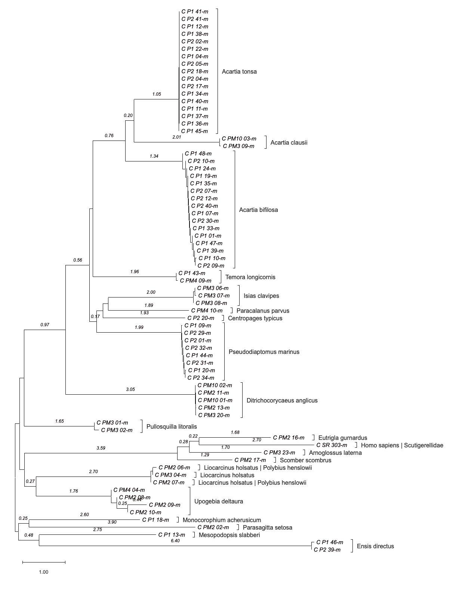

## 1 Data Preparation
To unify the data and prevent false sorting, leading zeros were added to all file names that were missing them.

### 1.1 Consensus Sequences
The dataset consisted of 154 files containing either a forward- or a reverse read. These were individually imported into Gear Genomic's [Pearl](https://www.gear-genomics.com/pearl) tool. A consensus sequence was created for each of them, resulting in a total of 76 DNA sequences. 44 of the consensus sequences had to be edited manually, for the rest, the automatically generated consensus sequences could be used without modification.

Manual editing included the following steps:
- resolving conflicts at single nucleotide positions based on the chromatogram
- checking the head and tail ends of each sequence for the qualitiy of the reads and cutting them off, if necessary

For those sequences that required modification, two files were exported: both the original automatic consensus sequence and the manually corrected one (marked either with `-a` or `-m` in the file name).
A small bash script ([edit_consensus.sh](edit_consensus.sh)) was written to rename the FASTA headers of the exported sequences. This is necessary because the files exported by Pearl all use the header '>user sequence', which is not informative. After running this script on the exported files, that useless header was replaced with the sequence name. The script also combines all fasta files into a single file.

```bash
# set the working directory from script input
work_dir=$1
cd $work_dir

# loop over every .fa file in the WD and replace 'user sequence' with the sequence name
for file in $(ls *.fa); do 
	# get the sequence name from the file name
	seq_name=$(basename $file .fa)
	echo $seq_name
	# replace sequence headers
	sed -i -e "s/user sequence/${seq_name}/g" $file
done

# remove all .fa-e files generated by SED
rm *.fa-e

# generate a new file for the multifasta
multifasta=$(echo seq_consensus-$(echo $(basename $(ls *.fa | head -n 1) .fa) | cut -d "-" -f 2).fasta)
echo > $multifasta

# concat all fasta files in the WD into a multifasta
for file in $(ls *.fa); do 
	cat $file >> $multifasta
	echo >> $multifasta
done
```

### 1.2 Complement Sequences
The combined multifasta is imported into Seaview. For each sequence, a reverse complement sequence is created, these are then exported into a new file [seq_complement.fst](data/seq/seq_complement.fst), which is again opened in Seaview. The genetic code for all sequences is initially set to 'Invertebrate Mitochondrial'.
By repeatedly checking the proteins that the sequences code for and adjusting the reading frame if necessary, the sequences are modified to not include any stop codons. Some sequences had stop codons in them, no matter which reading frame was chosen:
- P1_07
- P1_13
- P1_24
- P1_39
- P1_43
- P2_35
- PM2_17
- PM3_03
- PM4_06
- PM4_10

This issue could be resolved by going back to Pearl and re-evaluating the conflicts. A quick BLAST search (see section two) revealed that some of the sequences were related to non-invertebrates - the genetic code for those sequences was set to 'Vertebrate Mitochondrial'. Now, only the following sequences were still showing stop codons:
- P2_35
- PM3_03
- PM4_06

All sequences with their adjusted reading frames were saved into a multifasta file.

## 2 BLAST
After all sequences have been adjusted in Seaview, the new multifasta can be uploaded on NCBI's [Nucleotide BLAST](https://blast.ncbi.nlm.nih.gov/Blast.cgi) website. All settings were left on standard. This gives information on what species the sequences are likely from.
For every sequence, the top result was taken from the Taxonomy / Organism overview. If there were multiple results that were very close in their highest score, both were noted down. The results of the BLAST search can be seen in the table below.

> **Table 1** - Results of the BLAST search for all samples. Input for the search were complement sequences of input dataset.
> In total, 22 different species were found.

| Sequence | Taxon                        | Higher Taxon   | Per. Ident max | Query Cover | Notes      |
|----------|------------------------------|----------------|----------------|-------------|------------|
| P1_01    | *Acartia bifilosa*           | Crustacea      | 99,31%         | 84,00%      |            |
| P1_04    | *Acartia tonsa*              | Crustacea      | 100,00%        | 79,00%      |            |
| P1_07    | *Acartia bifilosa*           | Crustacea      | 99,09%         | 77,00%      |            |
| P1_09    | *Pseudodiaptomus marinus*    | Crustacea      | 99,84%         | 77,00%      |            |
| P1_10    | *Acartia bifilosa*           | Crustacea      | 99,84%         | 80,00%      |            |
| P1_11    | *Acartia tonsa*              | Crustacea      | 100,00%        | 77,00%      |            |
| P1_12    | *Acartia tonsa*              | Crustacea      | 100,00%        | 78,00%      |            |
| P1_13    | *Mesopodopsis slabberi*      | Crustacea      | 99,34%         | 53,00%      |            |
| P1_18    | *Monocorophium acherusicum*  | Crustacea      | 100,00%        | 77,00%      |            |
| P1_19    | *Acartia bifilosa*           | Crustacea      | 99,09%         | 92,00%      |            |
| P1_20    | *Pseudodiaptomus marinus*    | Crustacea      | 99,85%         | 79,00%      |            |
| P1_22    | *Acartia tonsa*              | Crustacea      | 100,00%        | 77,00%      |            |
| P1_24    | *Acartia bifilosa*           | Crustacea      | 99,24%         | 84,00%      |            |
| P1_33    | *Acartia bifilosa*           | Crustacea      | 99,24%         | 79,00%      |            |
| P1_34    | *Acartia tonsa*              | Crustacea      | 100,00%        | 78,00%      |            |
| P1_35    | *Acartia bifilosa*           | Crustacea      | 99,24%         | 74,00%      |            |
| P1_36    | *Acartia tonsa*              | Crustacea      | 100,00%        | 77,00%      |            |
| P1_37    | *Acartia tonsa*              | Crustacea      | 100,00%        | 77,00%      |            |
| P1_38    | *Acartia tonsa*              | Crustacea      | 100,00%        | 78,00%      |            |
| P1_39    | *Acartia bifilosa*           | Crustacea      | 100,00%        | 80,00%      |            |
| P1_40    | *Acartia tonsa*              | Crustacea      | 100,00%        | 77,00%      |            |
| P1_41    | *Acartia tonsa*              | Crustacea      | 100,00%        | 78,00%      |            |
| P1_43    | *Temora longicornis*         | Crustacea      | 100,00%        | 76,00%      |            |
| P1_44    | *Pseudodiaptomus marinus*    | Crustacea      | 100,00%        | 69,00%      |            |
| P1_45    | *Acartia tonsa*              | Crustacea      | 100,00%        | 76,00%      |            |
| P1_46    | *Ensis directus*             | Mollusca       | 100,00%        | 77,00%      |            |
| P1_47    | *Acartia bifilosa*           | Crustacea      | 100,00%        | 77,00%      |            |
| P1_48    | *Acartia bifilosa*           | Crustacea      | 98,68%         | 92,00%      |            |
| P2_01    | *Pseudodiaptomus marinus*    | Crustacea      | 100,00%        | 68,00%      |            |
| P2_02    | *Acartia tonsa*              | Crustacea      | 100,00%        | 77,00%      |            |
| P2_04    | *Acartia tonsa*              | Crustacea      | 100,00%        | 77,00%      |            |
| P2_05    | *Acartia tonsa*              | Crustacea      | 100,00%        | 78,00%      |            |
| P2_07    | *Acartia bifilosa*           | Crustacea      | 99,09%         | 75,00%      |            |
| P2_09    | *Acartia bifilosa*           | Crustacea      | 100,00%        | 80,00%      |            |
| P2_10    | *Acartia bifilosa*           | Crustacea      | 99,24%         | 87,00%      |            |
| P2_12    | *Acartia bifilosa*           | Crustacea      | 99,24%         | 78,00%      |            |
| P2_17    | *Acartia tonsa*              | Crustacea      | 100,00%        | 78,00%      |            |
| P2_18    | *Acartia tonsa*              | Crustacea      | 100,00%        | 78,00%      |            |
| P2_20    | *Centropages typicus*        | Crustacea      | 99,64%         | 66,00%      |            |
| P2_29    | *Pseudodiaptomus marinus*    | Crustacea      | 100,00%        | 74,00%      |            |
| P2_30    | *Acartia bifilosa*           | Crustacea      | 99,24%         | 97,00%      |            |
| P2_31    | *Pseudodiaptomus marinus*    | Crustacea      | 100,00%        | 77,00%      |            |
| P2_32    | *Pseudodiaptomus marinus*    | Crustacea      | 99,84%         | 74,00%      |            |
| P2_34    | *Pseudodiaptomus marinus*    | Crustacea      | 99,85%         | 78,00%      |            |
| P2_35*   | *Centropages typicus*        | Crustacea      | 99,46%         | 65,00%      |            |
| P2_39    | *Ensis directus*             | Mollusca       | 100,00%        | 53,00%      |            |
| P2_40    | *Acartia bifilosa*           | Crustacea      | 99,09%         | 78,00%      |            |
| P2_41    | *Acartia tonsa*              | Crustacea      | 100,00%        | 76,00%      |            |
| PM2_02   | *Parasagitta setosa*         | Chaetognatha   | 99,39%         | 76,00%      |            |
| PM2_06   | *Liocarcinus holsatus*       | Crustacea      | 100,00%        | 79,00%      | ambiguous |
| PM2_06   | *Polybius henslowii*         | Crustacea      | 100,00%        | 79,00%      | ambiguous |
| PM2_07   | *Liocarcinus holsatus*       | Crustacea      | 99,85%         | 76,00%      | ambiguous |
| PM2_07   | *Polybius henslowii*         | Crustacea      | 99,85%         | 76,00%      | ambiguous |
| PM2_08   | *Upogebia deltaura*          | Crustacea      | 99,54%         | 77,00%      |            |
| PM2_09   | *Upogebia deltaura*          | Crustacea      | 100,00%        | 70,00%      |            |
| PM2_10   | *Upogebia deltaura*          | Crustacea      | 99,85%         | 82,00%      |            |
| PM2_11   | *Ditrichocorycaeus anglicus* | Crustacea      | 99,85%         | 74,00%      |            |
| PM2_13   | *Ditrichocorycaeus anglicus* | Crustacea      | 99,38%         | 76,00%      |            |
| PM2_16   | *Eutrigla gurnardus*         | Actinopterygii | 99,69%         | 74,00%      |            |
| PM2_17   | *Scomber scombrus*           | Actinopterygii | 99,54%         | 77,00%      |            |
| PM3_01   | *Pullosquilla litoralis*     | Crustacea      | 85,31%         | 98,00%      |            |
| PM3_02   | *Pullosquilla litoralis*     | Crustacea      | 85,47%         | 99,00%      |            |
| PM3_03   | *Liocarcinus holsatus*       | Crustacea      | 100,00%        | 76,00%      | ambiguous |
| PM3_03*  | *Polybius henslowii*         | Crustacea      | 100,00%        | 75,00%      | ambiguous |
| PM3_04   | *Liocarcinus holsatus*       | Crustacea      | 99,70%         | 77,00%      |            |
| PM3_06   | *Isias clavipes*             | Crustacea      | 100,00%        | 77,00%      |            |
| PM3_07   | *Isias clavipes*             | Crustacea      | 99,85%         | 78,00%      |            |
| PM3_08   | *Isias clavipes*             | Crustacea      | 99,70%         | 77,00%      |            |
| PM3_09   | *Acartia clausii*            | Crustacea      | 99,83%         | 80,00%      |            |
| PM3_20   | *Ditrichocorycaeus anglicus* | Crustacea      | 100,00%        | 77,00%      |            |
| PM3_23   | *Arnoglossus laterna*        | Actinopterygii | 99,69%         | 79,00%      |            |
| PM4_04   | *Upogebia deltaura*          | Crustacea      | 99,24%         | 78,00%      |            |
| PM4_06*  | *Centropages typicus*        | Crustacea      | 98,75%         | 67,00%      |            |
| PM4_09   | *Temora longicornis*         | Crustacea      | 100,00%        | 85,00%      |            |
| PM4_10   | *Paracalanus parvus*         | Crustacea      | 100,00%        | 76,00%      |            |
| PM10_01  | *Ditrichocorycaeus anglicus* | Crustacea      | 100,00%        | 77,00%      |            |
| PM10_02  | *Ditrichocorycaeus anglicus* | Crustacea      | 99,70%         | 77,00%      |            |
| PM10_03  | *Acartia clausii*            | Crustacea      | 100,00%        | 86,00%      |            |
| SR_303   | Scutigerellidae              | Arthropoda     | 99,36%         | 100,00%     | suspicious |
| SR_303   | *Homo sapiens*               | Mammalia       | 99,35%         | 99,00%      | suspicous  |


Most of the sequences in the dataset were identified as Crustaceans. Some were not, notably the following ones:
- P1_46 and P2_39 are molluscs - *Ensis directus* (Bivalvia)
- PM2_2 is an arrow worm - *Sagitta setosa* (Chaetognatha)
- PM2_16, PM2_17 and PM3_23 are ray finned fishes:
    - *Eutrigla gurnardus*
    - *Scomber scombrus*
    - *Arnoglossus laterna*

Three sequences were ambiguous, with two species being identified with the highes score. For all three, it could either be *Liocarcinus holsatus* or *Polybius henslowii*:
- PM2_06
- PM2_07
- PM3_03

- SR_303 was a strong outlier, being either a member of the family Scutigerillidae (Arthropoda) or of the species *Homo sapiens* (Mammalia).

## Phylogeny
Before starting the phylogenetic analysis, the sequences in the multifasta were sorted. The three fish, the molluscs and the chaetognath were moved down to improve readability.

### Sequence Alignment & Grouping
After the initial alignment using MUSCLE, a pattern became clear: the three sequences P2_35, PM3_03 and PM4_06 did not fit the rest of the sequences. For some reason, they were much longer and created large gaps in the alignment.

> **Figure 1** - selective detail of the full alignment.

Removing these sequences from the alignment improved it by a lot.

> **Figure 2** - selective detail of the filtered alignment

The new alignment was saved to a MEGA session file and closed, then loaded back into MEGA for further analysis.

To improve readability of the phylogenetic tree, sequences were grouped by the species identified for them in BLAST. The ambiguous and suspicious sequences were named as 'Species_1 | Species_2'.

### Distance Matrix
A pairwise distance matrix was generated to calculate distances between the defined groups, as seen in the table below.

> **Table 2** - Pairwise distance matrix of BLAST-identified sequence groups.

| Group                                     | *Acartia bifilosa* | *Acartia clausii* | *Acartia tonsa* | *Centropages typicus* | *Ditrichocorycaeus anglicus* | *Isias clavipes* | *Liocarcinus holsatus* | *Liocarcinus holsatus* / *Polybius henslowii* | *Mesopodopsis slabberi* | *Monocorophium acherusicum* | *Paracalanus parvus* | *Parasagitta setosa* | *Pseudodiaptomus marinus* | *Pullosquilla litoralis* | *Temora longicornis* | *Upogebia deltaura* | *Ensis directus* | *Arnoglossus laterna* | *Eutrigla gurnardus* | *Scomber scombrus* | *Homo sapiens* / Scutigerellidae |
|-------------------------------------------|------------------|-----------------|---------------|---------------------|----------------------------|----------------|----------------------|-------------------------------------------|-----------------------|---------------------------|--------------------|--------------------|-------------------------|------------------------|--------------------|-------------------|----------------|---------------------|--------------------|------------------|--------------------------------|
| *Acartia bifilosa*                          |                  |                 |               |                     |                            |                |                      |                                           |                       |                           |                    |                    |                         |                        |                    |                   |                |                     |                    |                  |                                |
| *Acartia clausii*                           | 368.922          |                 |               |                     |                            |                |                      |                                           |                       |                           |                    |                    |                         |                        |                    |                   |                |                     |                    |                  |                                |
| *Acartia tonsa*                             | 278.792          | 307.863         |               |                     |                            |                |                      |                                           |                       |                           |                    |                    |                         |                        |                    |                   |                |                     |                    |                  |                                |
| *Centropages typicus*                       | 429.242          | 433.512         | 459.259       |                     |                            |                |                      |                                           |                       |                           |                    |                    |                         |                        |                    |                   |                |                     |                    |                  |                                |
| *Ditrichocorycaeus anglicus*                | 586.419          | 651.781         | 585.769       | 556.765             |                            |                |                      |                                           |                       |                           |                    |                    |                         |                        |                    |                   |                |                     |                    |                  |                                |
| *Isias clavipes*                            | 457.271          | 500.052         | 471.240       | 402.589             | 582.910                    |                |                      |                                           |                       |                           |                    |                    |                         |                        |                    |                   |                |                     |                    |                  |                                |
| *Liocarcinus holsatus*                      | 692.524          | 764.505         | 678.123       | 727.723             | 721.848                    | 742.640        |                      |                                           |                       |                           |                    |                    |                         |                        |                    |                   |                |                     |                    |                  |                                |
| *Liocarcinus holsatus* / *Polybius henslowii* | 693.490          | 764.938         | 688.302       | 732.040             | 740.222                    | 743.081        | 0.00508              |                                           |                       |                           |                    |                    |                         |                        |                    |                   |                |                     |                    |                  |                                |
| *Mesopodopsis slabberi*                     | 714.633          | 691.220         | 749.863       | 722.630             | 814.542                    | 734.905        | 591.207              | 598.362                                   |                       |                           |                    |                    |                         |                        |                    |                   |                |                     |                    |                  |                                |
| *Monocorophium acherusicum*                 | 679.399          | 682.987         | 665.372       | 696.928             | 679.701                    | 827.462        | 597.723              | 608.198                                   | 659.792               |                           |                    |                    |                         |                        |                    |                   |                |                     |                    |                  |                                |
| *Paracalanus parvus*                        | 474.740          | 395.928         | 439.968       | 399.994             | 491.609                    | 389.692        | 730.537              | 737.101                                   | 756.814               | 686.855                   |                    |                    |                         |                        |                    |                   |                |                     |                    |                  |                                |
| *Parasagitta setosa*                        | 802.925          | 810.745         | 822.177       | 951.553             | 811.106                    | 955.866        | 772.327              | 796.206                                   | 754.871               | 650.985                   | 948.442            |                    |                         |                        |                    |                   |                |                     |                    |                  |                                |
| *Pseudodiaptomus marinus*                   | 416.104          | 459.586         | 459.241       | 400.189             | 564.017                    | 440.209        | 749.548              | 767.237                                   | 677.396               | 743.151                   | 433.644            | 810.772            |                         |                        |                    |                   |                |                     |                    |                  |                                |
| *Pullosquilla litoralis*                    | 542.479          | 606.053         | 512.392       | 581.259             | 602.905                    | 634.514        | 449.867              | 463.440                                   | 533.543               | 514.557                   | 606.300            | 654.532            | 606.278                 |                        |                    |                   |                |                     |                    |                  |                                |
| *Temora longicornis*                        | 422.157          | 478.255         | 390.797       | 455.235             | 530.479                    | 437.491        | 658.864              | 662.305                                   | 712.984               | 841.185                   | 421.434            | 855.770            | 426.141                 | 530.310                |                    |                   |                |                     |                    |                  |                                |
| *Upogebia deltaura*                         | 607.728          | 553.039         | 616.473       | 656.925             | 688.973                    | 613.000        | 446.925              | 448.755                                   | 503.908               | 525.839                   | 609.582            | 711.589            | 681.361                 | 359.562                | 601.979            |                   |                |                     |                    |                  |                                |
| *Ensis directus*                            | 1.187.439        | 900.529         | 1.021.185     | 1.083.381           | 976.323                    | 1.176.871      | 1.069.546            | 1.056.151                                 | 915.221               | 987.474                   | 1.012.348          | 1.022.274          | 1.094.358               | 800.906                | 1.246.563          | 893.267           |                |                     |                    |                  |                                |
| *Arnoglossus laterna*                       | 895.662          | 934.158         | 988.988       | 913.116             | 969.909                    | 954.206        | 824.874              | 823.957                                   | 941.148               | 909.437                   | 989.141            | 999.575            | 880.483                 | 719.822                | 875.917            | 821.413           | 1.272.352      |                     |                    |                  |                                |
| *Eutrigla gurnardus*                        | 1.020.820        | 1.006.383       | 1.073.330     | 908.888             | 797.386                    | 898.920        | 635.847              | 653.953                                   | 852.318               | 874.881                   | 881.948            | 895.254            | 828.061                 | 740.631                | 840.989            | 889.555           | 1.331.779      | 333.807             |                    |                  |                                |
| *Scomber scombrus*                          | 864.629          | 1.003.797       | 885.252       | 886.218             | 762.796                    | 893.316        | 760.770              | 770.394                                   | 856.772               | 749.958                   | 831.312            | 942.521            | 774.814                 | 758.837                | 873.374            | 855.504           | 1.232.771      | 362.990             | 293.240            |                  |                                |
| *Homo sapiens* / Scutigerellidae            | 1.065.277        | 1.038.558       | 1.109.990     | 1.095.547           | 1.131.596                  | 1.054.135      | 746.944              | 762.332                                   | 1.131.563             | 1.016.037                 | 1.155.369          | 1.157.157          | 1.059.755               | 814.989                | 953.688            | 788.712           | 1.345.646      | 488.892             | 438.847            | 432.290          |                                |


### Neighbour-Joining Tree
After calculating the distance matrix, a phylogenetic tree was generated using the neighbour-joining method. The figure below shows the optimal tree with the sum of branch length of 55.054, drawn to scale.


> **Figure 3** - Unrooted optimal tree of 73 sequences, generated in MEGA using the neighbour-joining method. Branch lengths over 0.15 are shown on the branches, species groups identified by BLAST are marked as well.

### Ambiguous Species
A literature review revealed the reason behind the three ambiguously identified species.